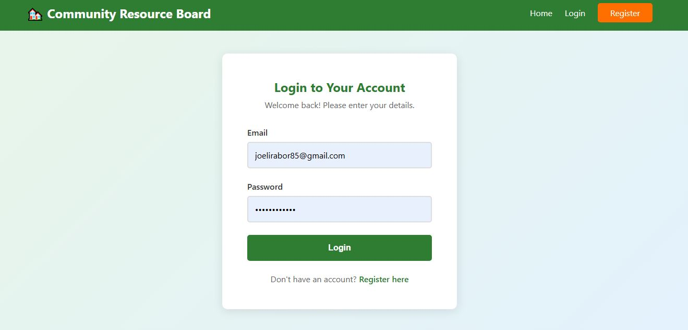
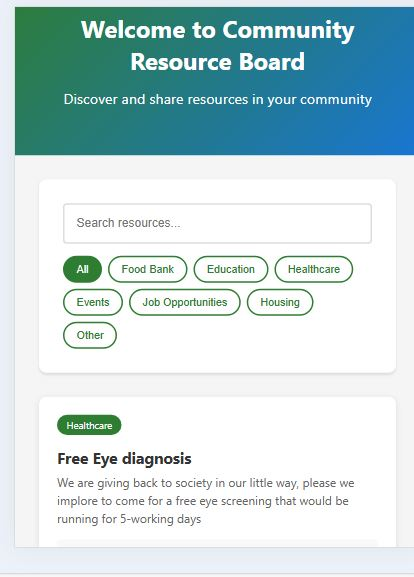
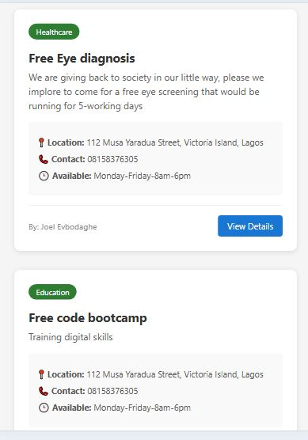

# 🏘️ Community Resource Board

A full-stack MERN (MongoDB, Express, React, Node.js) application that connects communities with essential resources like food banks, educational programs, healthcare services, and job opportunities. The platform separates resource providers (donors) from those seeking help (beneficiaries), creating an efficient and organized community support system.

## 🌍 UN SDG Alignment

This project directly supports **UN Sustainable Development Goal 11: Sustainable Cities and Communities** by:
- Creating accessible platforms for resource sharing
- Strengthening community connections
- Reducing information barriers
- Empowering vulnerable populations

---

## ✨ Features

### 🔐 Authentication & Authorization
- User registration and login with JWT
- Role-based access control (Donor, Beneficiary, Both)
- Secure password hashing with bcrypt
- Protected routes and API endpoints

### 👥 Role-Based System
- **Beneficiaries (🙋)**: Browse and search for resources
- **Donors (🤝)**: Post and manage community resources
- **Both (👥)**: Full access to all features
- Organization profiles for donors

### 📝 Resource Management
- Create, read, update, and delete resources
- Categorized resources (Food Bank, Education, Healthcare, Events, Job Opportunities, Housing, Other)
- Detailed resource information (location, contact, availability)
- User-specific resource dashboard

### 🔍 Search & Discovery
- Real-time search functionality
- Filter by category
- Responsive resource cards
- Detailed resource views

### 🎨 User Experience
- Clean, modern interface
- Responsive design (mobile-friendly)
- Intuitive navigation
- Visual role indicators
- Error handling and loading states

---

## 🛠️ Tech Stack

### Frontend
- **React.js** - UI library
- **React Router** - Client-side routing
- **Axios** - HTTP client
- **Context API** - State management
- **CSS3** - Styling

### Backend
- **Node.js** - Runtime environment
- **Express.js** - Web framework
- **MongoDB** - NoSQL database
- **Mongoose** - ODM library
- **JWT** - Authentication tokens
- **Bcrypt.js** - Password hashing
- **CORS** - Cross-origin resource sharing

---

## 📁 Project Structure
```
community-resource-board/
├── client/                    # React frontend
│   ├── public/
│   ├── src/
│   │   ├── components/       # Reusable components
│   │   │   ├── Navbar.js
│   │   │   └── Navbar.css
│   │   ├── pages/           # Page components
│   │   │   ├── Home.js
│   │   │   ├── Login.js
│   │   │   ├── Register.js
│   │   │   ├── CreateResource.js
│   │   │   ├── ResourceDetail.js
│   │   │   ├── MyResources.js
│   │   │   └── *.css
│   │   ├── context/         # Global state
│   │   │   ├── AuthContext.js
│   │   │   └── useAuth.js
│   │   ├── utils/           # Utilities
│   │   │   └── api.js
│   │   ├── App.js
│   │   └── index.js
│   └── package.json
│
├── server/                   # Node/Express backend
│   ├── config/
│   │   └── db.js            # Database connection
│   ├── controllers/
│   │   ├── authController.js
│   │   └── resourceController.js
│   ├── middleware/
│   │   └── auth.js          # JWT verification
│   ├── models/
│   │   ├── User.js
│   │   └── Resource.js
│   ├── routes/
│   │   ├── auth.js
│   │   └── resources.js
│   ├── server.js            # Entry point
│   └── package.json
│
├── .gitignore
└── README.md
```

---

## 🚀 Installation & Setup

### Prerequisites
- Node.js (v14 or higher)
- MongoDB (local installation or MongoDB Atlas account)
- npm or yarn

### 1. Clone the Repository
```bash
git clone https://github.com/Austinixe/Community_Resource_App.git
cd Community_Resource_App
```

### 2. Backend Setup
```bash
# Navigate to server directory
cd server

# Install dependencies
npm install

# Create .env file
touch .env
```

**Configure `.env` file:**
```env
PORT=5000
MONGO_URI=your_mongodb_connection_string
JWT_SECRET=your_super_secret_jwt_key
```

**Start backend server:**
```bash
npm run dev
```

Backend will run on `https://resource-board-backend.onrender.com` for deployed environment.


### 3. Frontend Setup

Open a new terminal:
```bash
# Navigate to client directory
cd client

# Install dependencies
npm install

# Start frontend
npm start
```

Frontend will run on `http://localhost:3000`

---

## 🎯 Usage

### For Beneficiaries
1. Register as a **Beneficiary**
2. Browse available community resources
3. Use search and filters to find specific resources
4. View detailed information including location, contact, and availability

### For Donors/Organizations
1. Register as a **Donor** or **Both**
2. Add your organization name (optional)
3. Post resources to share with the community
4. Manage your posted resources
5. Update or delete resources as needed

---

## 🔒 Security Features

- Passwords hashed with bcrypt (salt rounds: 10)
- JWT tokens for secure authentication
- Protected API routes with middleware
- Role-based access control
- Input validation on frontend and backend
- CORS configuration for API security

---

## 📊 Database Schema

### User Model
```javascript
{
  name: String (required),
  email: String (required, unique),
  password: String (required, hashed),
  role: String (enum: ['donor', 'beneficiary', 'both']),
  organization: String (optional),
  phone: String (optional),
  timestamps: true
}
```

### Resource Model
```javascript
{
  title: String (required, max 100 chars),
  description: String (required, max 500 chars),
  category: String (enum: predefined categories),
  location: String (required),
  contactInfo: String (required),
  availability: String (optional),
  postedBy: ObjectId (ref: User),
  timestamps: true
}
```

---

## 🧪 API Endpoints

### Authentication Routes
```
POST /api/auth/register    - Register new user
POST /api/auth/login       - Login user
```

### Resource Routes
```
GET    /api/resources                - Get all resources (Public)
GET    /api/resources/:id            - Get single resource (Public)
POST   /api/resources                - Create resource (Protected - Donors only)
PUT    /api/resources/:id            - Update resource (Protected - Owner only)
DELETE /api/resources/:id            - Delete resource (Protected - Owner only)
GET    /api/resources/user/my-resources - Get user's resources (Protected)
```

---

## 🎨 Screenshots

### 1. Homepage & Search

* 

### 2. Created Reource view

* 

### 3. View details of created Resource

* 


### Create Resource (Donors)
*Easy-to-use form for posting new resources*

### My Resources Dashboard
*Manage your posted resources*

---

## 🚀 Future Enhancements

- [ ] Edit resource functionality
- [ ] Image upload for resources
- [ ] Email verification
- [ ] Password reset functionality
- [ ] Advanced search filters (location-based)
- [ ] Map integration for resource locations
- [ ] Email notifications for new resources
- [ ] Resource rating and reviews
- [ ] Admin dashboard
- [ ] Analytics and reporting
- [ ] Mobile app (React Native)
- [ ] Multi-language support

---

## 🤝 Contributing

Contributions are welcome! Please feel free to submit a Pull Request.

1. Fork the project
2. Create your feature branch (`git checkout -b feature/AmazingFeature`)
3. Commit your changes (`git commit -m 'Add some AmazingFeature'`)
4. Push to the branch (`git push origin feature/AmazingFeature`)
5. Open a Pull Request

---


---

## 👨‍💻 Author

**[Augustin Omonkaro Salami]**
- GitHub: [@Austinixe](https://github.com/Austinixe)


---

## 🙏 Acknowledgments

- Built as part of a software development project
- Inspired by the need for better community resource coordination
- Aligned with UN Sustainable Development Goals
- Thanks to all open-source contributors whose libraries made this possible

---

## 📞 Support

For support, email [lexxley59@gmail.com] or open an issue in the GitHub repository.

---

## 🌟 Show Your Support

Give a ⭐️ if this project helped you or inspired you!

---

**Built with ❤️ for stronger communities**